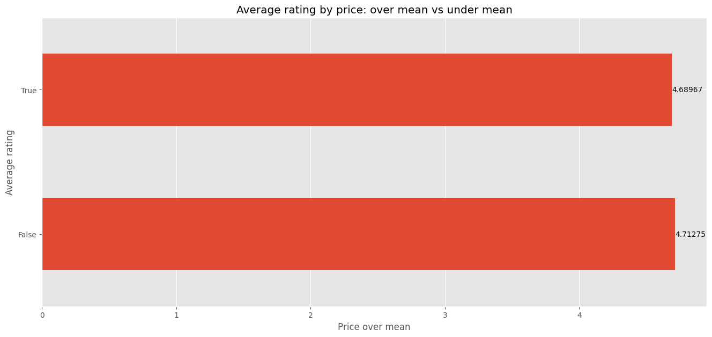
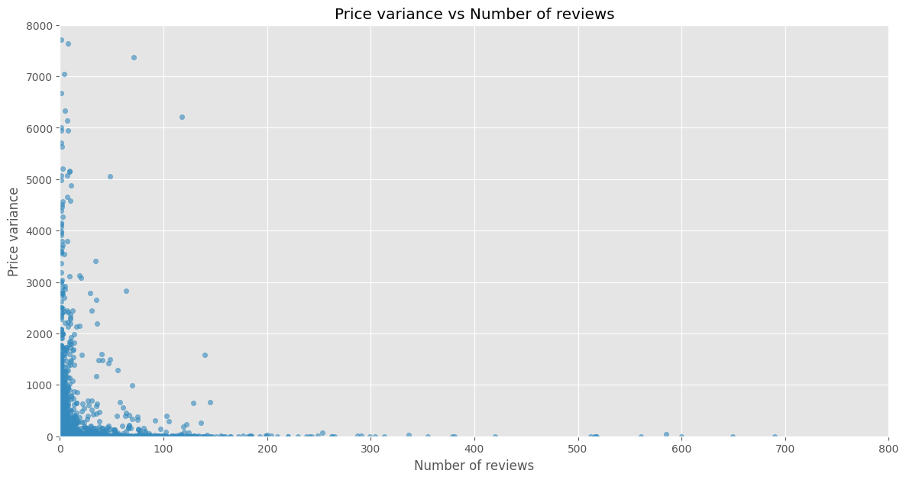
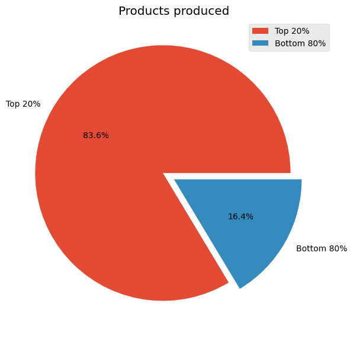

# Amazon UK Fashion Product Analytics

## Table of Contents
[[_TOC_]]

## Project Overview
This project presents an analysis of fashion product data, focusing on review metrics and pricing strategies. The analysis explores patterns and insights that are crucial for understanding consumer behavior to regulate market strategy accordingly.

TL;DR [JUMP TO RESULTS](#analysis-and-results)

## Data
The analysis is based on a dataset containing information on various fashion products scraped from [Amazon UK](https://amazon.co.uk), including:

- manufacturer
- average review rating
- number of reviews
- price
- other seller prices

## Methods
The process consists of 3 macro-steps:
1. **Data Cleaning** involves preparing the raw data for analysis by addressing any inaccuracies or inconsistencies. For the fashion product dataset, this step included:
    - Handling Missing Values: Imputing missing review ratings or excluding incomplete records.
    - Correcting Errors: Ensuring that all numerical entries (such as prices and ratings) are correctly formatted.
    - Removing Duplicates: Eliminating redundant records or columns.
    - Standardizing Formats: Ensuring consistent formatting across the dataset (e.g. numerical formats for prices).
2. **Data Wrangling** transformed the cleaned data into a more usable structure for analysis. Key transformations included:
    - Data Aggregation: Calculating the mean review ratings and total number of reviews for each manufacturer.
    - Feature Engineering: Creating a new feature to measure price variance by comparing each product's price against alternative prices.
3. **Data Analysis** focused on exploring the processed data to extract meaningful insights. This involved: 
    - Descriptive Statistics: Analyzing summary statistics such as the average review rating per manufacturer.
    - Data Visualization: Using scatter plots to visualize the relationship between average review ratings and the number of reviews.
    - Inferential Analysis: Identifying trends and patterns, such as the Pareto Principle in production and the inverse relationship between price variance and review count.

## Key Techniques
- **Grouping and Aggregation**: Analyzing data by manufacturers to find average ratings and total reviews.
- **Visualization**: Creating scatter plots to depict relationships between various metrics.

## Analysis and Results

### Percieved Value


The average rating of products on the lower end of the competition price range is basically the same (factoring in the bias) as the average rating of products on the higher end. This is a crucial information. It implies that the average customer gives more value to ** the experience** with the product itself rather than its price.

### Price Variance Analysis


The plot above illustrates the inverse relationship between price variance and the number of reviews. Products with stable pricing tend to receive a higher number of reviews, indicating an increased consumer trust and engagement, which implies a higher number of sales.

### Pareto Principle (80/20 rule)


The Pareto chart demonstrates that approximately 80% of the products are produced by 20% of the manufacturers, confirming the Pareto Principle in the context of fashion product manufacturing. This indicates that a small number of manufacturers dominate the market in terms of product variety.

## Additional Notes
For this project, imputation was not used to fill the missing field. For example, the `price` field could have been filled with the mean since it does not alter its distribution, but it heavily decreases the accuracy of the dataset.

## Dependencies
The project requires the following Python packages:
- pandas: For data manipulation and analysis.
- numpy: For numerical operations.
- matplotlib: For creating plots and charts.
Ensure all dependencies are installed by running:

```bash
pip install pandas numpy matplotlib
```

## Usage
To explore the analysis and results in detail, open and run the Jupyter notebook provided:

1. Download the repository or clone it using Git:
```bash
git clone https://github.com/your-username/fashion-product-analytics.git
```
2. Navigate to the project directory:
```bash
cd fashion-product-analytics
```
3. Launch Jupyter Notebook:
```bash
jupyter notebook fashion_product_analytics.ipynb
```

## Contributing
Contributions are welcome! Please follow these steps:

1. Fork the repository.
2. Create a new branch (git checkout -b feature/your-feature).
3. Commit your changes (git commit -m 'Add some feature').
4. Push to the branch (git push origin feature/your-feature).
5. Create a pull request.

## Acknowledgements
Dataset provided by [data.world](https://data.world/)

## Liked my work?
Reach out to me on [LinkedIn](https://www.linkedin.com/in/ahmed-maruf-15684a212/)

Thank you for reading! Consider leaving a star if you liked the project ☆\*: .｡. o(≧▽≦)o .｡.:\*☆